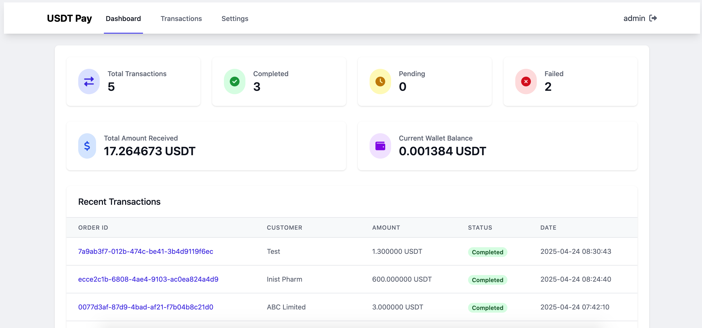
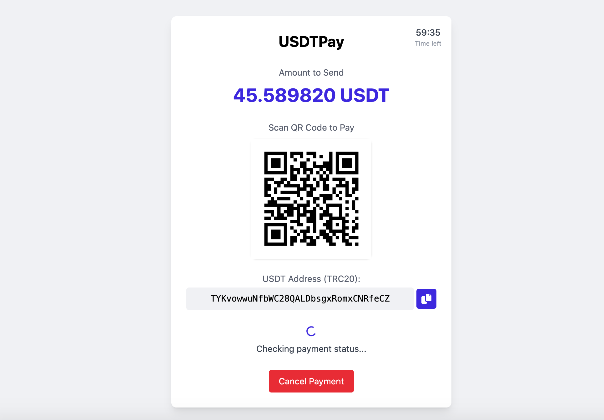
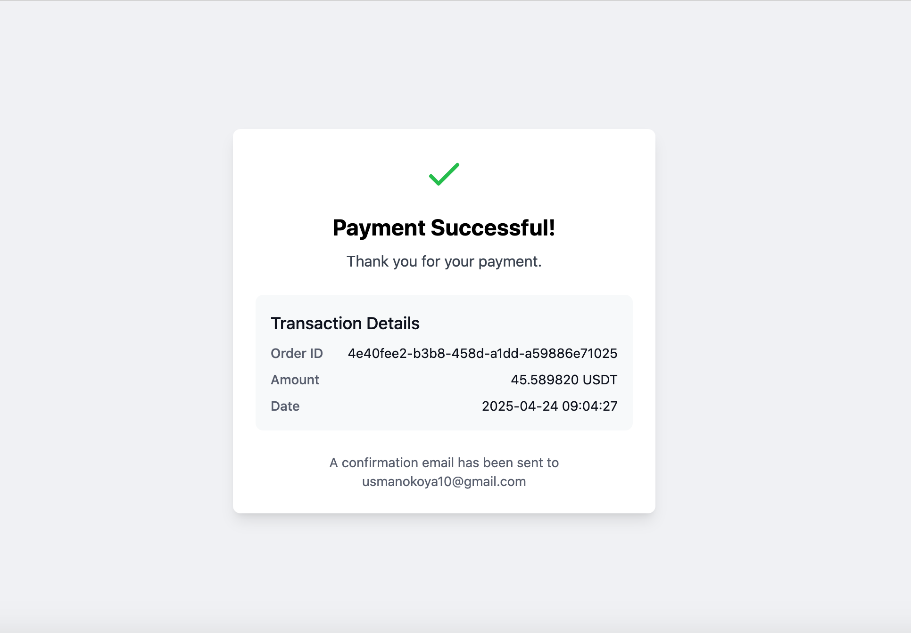

# USDTPay - USDT Payment Gateway



USDTPay is a secure and efficient payment gateway that allows merchants to accept USDT (Tether) payments. It provides a simple integration process and a user-friendly interface for both merchants and customers.

## Features

### For Merchants
- 🛡️ Secure admin dashboard
- 📊 Transaction management and monitoring
- ⚙️ Customizable settings (USDT address, timeout, check interval)
- 📈 Transaction statistics and reporting
- 🔍 Detailed transaction history with filtering options

### For Customers
- 💳 Simple checkout process with QR code.
- ⏱️ Real-time payment status updates
- 📱 Mobile-responsive design
- 📋 One-click copy for USDT address and amount
- 🔄 Automatic payment verification

### Technical Features
- 🔒 Secure session management
- 📦 Clean URL structure
- 🎨 Modern UI with Tailwind CSS
- 📱 Fully responsive design
- 🔄 Real-time transaction status updates
- 🛡️ SQL injection prevention
- 🔐 XSS protection

## Screenshots

### Admin Dashboard


### Checkout Page


### Payment Success


## Installation Guide

### Prerequisites
- PHP 7.4 or higher
- MySQL 5.7 or higher
- Apache web server
- mod_rewrite enabled

### Step 1: Clone the Repository
```bash
git clone https://github.com/okoyausman/usdt-payment-gateway-php.git
cd usdt-payment-gateway-php
```

### Step 2: Configure Database
1. Create a new MySQL database
2. Import the database schema from `database.sql`
3. Update the database credentials in `config.php`

### Step 3: Set Up .htaccess
Make sure your `.htaccess` file is properly configured for URL rewriting:

## Database Setup

The system uses the following main tables:

### admin_users
- Stores administrator credentials

### transactions
- Stores all payment transactions
- Tracks payment status and details

### settings
- Stores system configuration
- USDT receiving address and network
- Checkout timeout
- Transaction check interval

## Default Login

The system comes with a default administrator account:
- Username: `admin`
- Password: `admin123`

**Important:** Change these credentials immediately after installation.

## How It Works

### Payment Flow
1. Merchant creates a transaction through the admin panel
2. System generates a unique order ID and checkout URL
3. Customer visits the checkout page
4. Customer sends USDT to the specified address
5. System verifies the payment automatically
6. Transaction status updates in real-time
7. Merchant can view and manage transactions in the admin panel

### Security Features
- All user inputs are sanitized
- SQL queries use prepared statements
- Session management with proper validation
- XSS protection through output escaping
- CSRF protection for forms

### Technical Implementation
- Uses PDO for database operations
- Implements MVC-like structure
- Real-time status updates using JavaScript
- Responsive design with Tailwind CSS
- Clean URL routing system

## Contributing

Contributions are welcome! Please feel free to submit a Pull Request.

## License

This project is licensed under the MIT License - see the LICENSE file for details.

## Support

For support, please open an issue in the GitHub repository or contact the maintainers.

## Acknowledgments

- Font Awesome for icons
- Tailwind CSS for styling
- PHP QR Code for QR code generation 